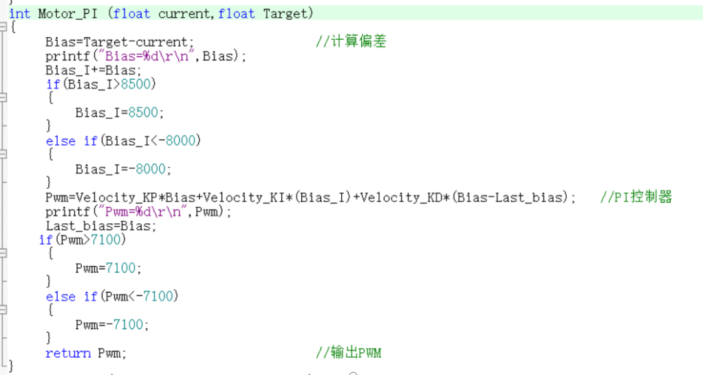
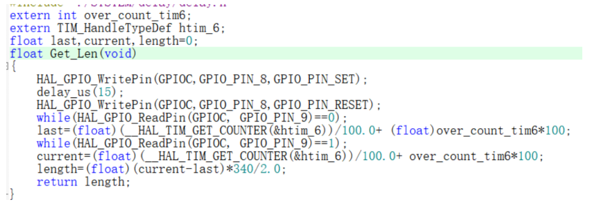
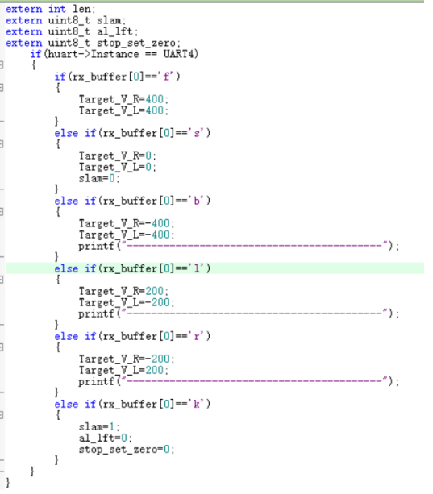

## 项目目标

以STM32F103作为下位机主控芯片，树莓派4b作为上位机，开发一套支持SLAM（即时定位与建图）、YOLOv5目标检测在内的低成本机器人开发套件。具体功能如下：

### 下位机部分

- STM32定时器编码器模式测速
- 超声波测距
- 与障碍物距离小于30cm时，蜂鸣器报警并自动避障
- 电机PID调速
- 微信小程序进行控制（蓝牙转串口）

### 上位机部分

- 通过USB转串口进行上下位机通信
- 搭载Ubuntu20.04以及ROS-Noetic进行建图（Gmapping）。
- YOLOv5目标检测
- 采用蒙特卡罗法进行机器人定位

## 一、市场需求及产品定位

机器人学作为一门讲求理论与实际相结合的学科，在学习过程中需要大量的案例进行实践，但由于机器人学知识覆盖面较广并且硬件成本较高等原因，大部分同学难以进行实践和编程开发，对当前机器人学的普及造成了较大阻碍。因此，我们计划开发出一套适合计算机、电子、自动化专业同学入门机器人的开源教程，帮助有志于机器人方向的同学从硬件选型再到系统设计，完整的开发出一台自己的入门型移动机器人。同时，为了避免商业纠纷，项目只提供下位机控制代码以及上位机开发教程源码，硬件部分只提供选型建议,不作具体推荐。

## 二、实现流程

                                                                                     

 当前项目已完成下位机的部分开发工作（下位机采用HAL库进行开发），开发流程及部分源码如下。

#### ①电机PID调速

电机采用GMR巨磁阻编码器，单位时间内脉冲数量较多，因此采用定时器的编码器模式进行脉冲计数。

②超声波测距

#### ②超声波测距

测距模块采用HR04,通过定时器计数得到脉冲时间，将其换算为实际距离，具体换算方式如下：

#### ③蜂鸣器模块

如图当超声波测距小于25cm时，蜂鸣器开始蜂鸣提示。

#### ④小程序控制（蓝牙转串口）

下位机采用HC-08（蓝牙转串口）模块进行串口通信控制，小程序端非本项目团队自行开发，在做产品调研时我们通过蓝牙测试偶然间得到了易方体微信小程序的蓝牙控制协议，在对该公司通信协议进行适配后，实现了使用该公司的小程序控制本项目开发的智能小车。

#### ⑤舵机控制

当启动避障模式时，由于超声波方向需要舵机转角进行控制，每个四个时钟周期判断一次舵机转向，并通过定时器输出PWM波进行舵机角度控制（74为正前方，24为正左方，124为正右方）。

## 三、后续规划

以上部分为下位机代码初步实现，接下来将进一步优化工程逻辑，并进一步开发上位机项目。

## 四、项目感想

**开发过程中遇到的问题：**

**① 工程文件烧录失败**

经过检查，确认是由于电源模块短路导致单片机供电电压过大，芯片被烧坏。

**② PID响应慢**

由于PID计算函数的积分限幅过小，导致电机无法及时响应。

**③ 编码器测速曲线异常**

原因是在开发过程中将额定3.3V的编码器接口误接了5V电源，导致电机编码器烧坏。

**④ 小车直线行进偏差较大**

由于PID参数调整有误，导致两侧电机响应速度不一致，因此造成了小车的直线偏差。

**⑤ 电机转动异常**

由于电机功率较大，接入两个电机的情况下由于电源模块的电流保护机制，会对模块输出功率进行限制，导致电机转动异常。

在实际开发过程中，往往会遇到许多设计方案时难以预料的问题，尤其嵌入式设计要经常宇硬件打交道，很多时候开发者需要不仅需要调试软件，还需要确认硬件的工作状态，实际开发过程中遇到的错误也更加具有实际意义。因此，在嵌入式单片机的学习过程中，不仅需要掌握书本知识，更要多动手实践，将理论与实践相结合，才能在嵌入式的道路上走得更远。另外，小车的开发也存在许多值得改进的地方，例如当前小车的自动转向时开环控制，可以结合IMU的角度传感器进行闭环控制，并且本次开发所用的单片机也可以采用价格更低的系统核心板进行开发，自行引出引脚，甚至通过合理的增大代码密度，优化功能设计方式，可以将代码移植到价格更低的单片机上，以达到降本增效的目的。